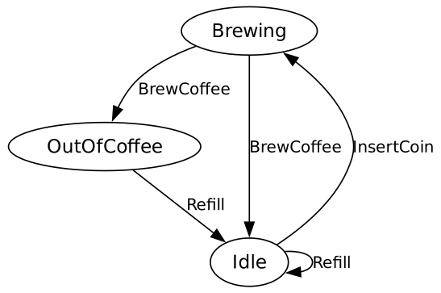

# Typomata

Typomata is a Python state machine library that leverages type hints to define state transitions. It allows you to create state machines by defining states and actions as classes and transitions as methods with type-annotated parameters and return types.

## Features

- Define states and actions as classes.
- Use type hints to define transitions.
- Automatically collects transitions based on type annotations.
- Generate state machine diagrams using Graphviz.



## Installation and Getting Started

```bash
uv sync
# from project root
uv run python examples/example_usage.py
# Will create a state_machine_diagram.gv.pdf

# running tests from project root
uv run python -m unittest discover tests
```

## Requirements
Python 3.8 or higher.

## Usage
### Defining States and Actions
```python
# --- States ---
@dataclass(frozen=True)
class Idle(BaseState):
    coffee_stock: int


@dataclass(frozen=True)
class Brewing(BaseState):
    coffee_stock: int


@dataclass(frozen=True)
class OutOfCoffee(BaseState):
    pass


# --- Actions ---
@dataclass(frozen=True)
class InsertCoin(BaseAction):
    pass


@dataclass(frozen=True)
class BrewCoffee(BaseAction):
    pass


@dataclass(frozen=True)
class Refill(BaseAction):
    amount: int
```

### Creating the State Machine
```python
class CoffeeMachine(BaseStateMachine):
    @transition
    def start_brewing(self, state: Idle, action: InsertCoin) -> Brewing:
        return Brewing(state.coffee_stock)

    @transition
    def finish_brewing(self, state: Brewing, action: BrewCoffee) -> Union[Idle, OutOfCoffee]:
        new_stock = state.coffee_stock - 1
        if new_stock > 0:
            return Idle(new_stock)
        else:
            return OutOfCoffee()

    @transition
    def refill_machine(self, state: Union[Idle, OutOfCoffee], action: Refill) -> Idle:
        if isinstance(state, OutOfCoffee):
            return Idle(action.amount)
        else:
            return Idle(state.coffee_stock + action.amount)
```

### Running the State Machine
```python
def main():
    machine = CoffeeMachine()

    # Generate state machine diagram
    generate_state_machine_diagram(CoffeeMachine)

    # Print transition map
    pprint(machine.transition_map())

    # Explicit state change
    state = machine.start_brewing(Idle(1), InsertCoin())
    print(type(state)) # <class '__main__.Brewing'>

    # Runtime Exception if there is no transition
    try:
        state = machine.start_brewing(OutOfCoffee(), InsertCoin())
    except Exception as e:
        print(repr(e)) # ValueError("Invalid state OutOfCoffee for start_brewing, expected one of ['Idle']")

    # Pass any combination of State and Action to
    # machine.run  and it will find the correct transition by itself
    state = Idle(coffee_stock=2)
    actions = [
        InsertCoin(), BrewCoffee(), InsertCoin(), BrewCoffee(), Refill(amount=3), InsertCoin(), BrewCoffee()]

    for action in actions:
        new_state = machine.run(state, action)
        print(f"Action: {action}, Transitioned from {state} to {new_state}")
        state = new_state
```

### Generating the State Machine Diagram
```python
from typomata import generate_state_machine_diagram

generate_state_machine_diagram(MyStateMachine)
```
This will create a `state_machine_diagram.gv.pdf` file illustrating your state machine.

## License
This project is licensed under the MIT License - see the LICENSE file for details.

## Contributing
Contributions are welcome! Please open an issue or submit a pull request.
