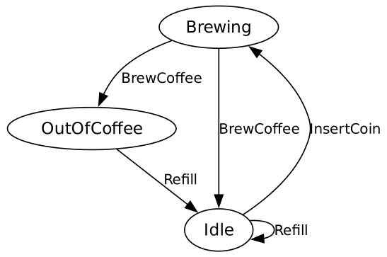

# Typomata

Typomata is a Python state machine library that leverages type hints to define state transitions. It allows you to create state machines by defining states and actions as classes and transitions as methods with type-annotated parameters and return types.

## Features

- Define states and actions as classes.
- Use type hints to define transitions.
- Automatically collects transitions based on type annotations.
- Generate state machine diagrams using Graphviz.



## Installation and Getting Started

```bash
uv sync --locked
# from project root
uv run --locked python examples/example_usage.py
# Will create a state_machine_diagram.gv.pdf

# running tests from project root
uv run --locked python -m unittest discover -s tests -v
```

## Requirements
Python 3.10 or higher. CI currently tests Python 3.10–3.14.

We support stable Python versions until their [upstream end of life](https://devguide.python.org/versions/), unless a documented technical constraint prevents support. New stable versions are added to CI when released; prerelease versions are not part of the support guarantee. The minimum Python version is raised in a subsequent Typomata release after the oldest supported version reaches end of life.

## Transition contract

The [transition contract](docs/transition-contract.md) defines the intended behavior for the next release, including supported annotations, dispatch, inheritance, and static typing. It also lists current implementation limitations.

## Usage
### Defining States and Actions
```python
# --- States ---
@dataclass(frozen=True)
class Idle(BaseState):
    coffee_stock: int


@dataclass(frozen=True)
class Brewing(BaseState):
    coffee_stock: int


@dataclass(frozen=True)
class OutOfCoffee(BaseState):
    pass


# --- Actions ---
@dataclass(frozen=True)
class InsertCoin(BaseAction):
    pass


@dataclass(frozen=True)
class BrewCoffee(BaseAction):
    pass


@dataclass(frozen=True)
class Refill(BaseAction):
    amount: int
```

### Creating the State Machine
```python
class CoffeeMachine(BaseStateMachine):
    @transition
    def start_brewing(self, state: Idle, action: InsertCoin) -> Brewing:
        return Brewing(state.coffee_stock)

    @transition
    def finish_brewing(self, state: Brewing, action: BrewCoffee) -> Union[Idle, OutOfCoffee]:
        new_stock = state.coffee_stock - 1
        if new_stock > 0:
            return Idle(new_stock)
        else:
            return OutOfCoffee()

    @transition
    def refill_machine(self, state: Union[Idle, OutOfCoffee], action: Refill) -> Idle:
        if isinstance(state, OutOfCoffee):
            return Idle(action.amount)
        else:
            return Idle(state.coffee_stock + action.amount)
```

### Running the State Machine
```python
def main():
    machine = CoffeeMachine()

    # Generate state machine diagram
    generate_state_machine_diagram(CoffeeMachine)

    # Print transition map
    pprint(machine.transition_map())

    # Explicit state change
    state = machine.start_brewing(Idle(1), InsertCoin())
    print(type(state)) # <class '__main__.Brewing'>

    # Runtime Exception if there is no transition
    try:
        state = machine.start_brewing(OutOfCoffee(), InsertCoin())
    except Exception as e:
        print(repr(e)) # ValueError("Invalid state OutOfCoffee for start_brewing, expected one of ['Idle']")

    # Pass any combination of State and Action to
    # machine.run  and it will find the correct transition by itself
    state = Idle(coffee_stock=2)
    actions = [
        InsertCoin(), BrewCoffee(), InsertCoin(), BrewCoffee(), Refill(amount=3), InsertCoin(), BrewCoffee()]

    for action in actions:
        new_state = machine.run(state, action)
        print(f"Action: {action}, Transitioned from {state} to {new_state}")
        state = new_state
```

### Generating the State Machine Diagram
```python
from typomata import generate_state_machine_diagram

generate_state_machine_diagram(MyStateMachine)
```
This will create a `state_machine_diagram.gv.pdf` file illustrating your state machine.

## License
This project is licensed under the MIT License - see the LICENSE file for details.

## Contributing
Contributions are welcome! Please open an issue or submit a pull request.

From a checkout, install [uv](https://docs.astral.sh/uv/getting-started/installation/) and run:

```bash
uv sync --locked --dev
uv run --locked python -m unittest discover -s tests -v
uv run --locked mypy
```

CI uses uv 0.12.10 and runs these checks on Python 3.10–3.14. To select an interpreter locally, pass `--python 3.10` (or another supported version) to both `uv sync` and `uv run`.

The committed `uv.lock` fixes dependency versions for development and CI. The `--locked` flag rejects an outdated lockfile; see [uv's locking documentation](https://docs.astral.sh/uv/concepts/projects/sync/). After intentionally changing dependencies, run `uv lock`, review the resulting changes, and commit `pyproject.toml` and `uv.lock` together. Use `uv lock --upgrade-package mypy` for a targeted mypy update. Library consumers continue to use the dependency ranges in package metadata; mypy is a development dependency only.

The mypy configuration checks the library source against the Python 3.10 language baseline, including bodies of unannotated functions. Graphviz's missing typing information is ignored only for that dependency. This baseline does not yet verify the installed package's typing behavior or the examples; those checks are part of the remaining [typing contract work](docs/transition-contract.md#static-typing).
